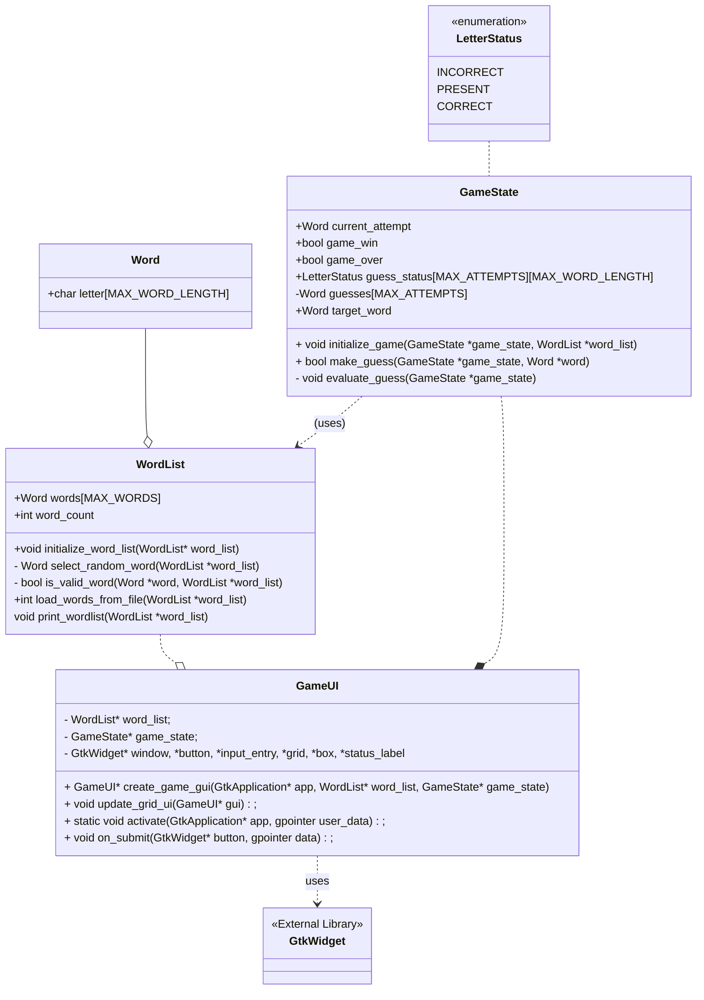
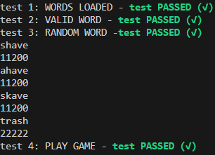

# WORDLE SIMULATION
## Requirements
- Player should be able to start a fresh game.
- Player should be able to enter a 5 letter word.
- Player should be notified on the status of the letter existence and position. They should be indicated by color code

| Status    | Color  |
| -------- | ------- |
| INCORRECT  | Grey    |

-

## Design
### Classes and Objects
- **Word** - Set of letters, max of size MAX_WORD_LENGTH (5)
- **WordList** - Set of all existing MAX_WORD_LENGTH Words, MAX_WORDS (2315)
- **GameState** - Maintains the current status of a running game.
  - current_attempt - 
  - guesses - List to store guess (Word) made by user.
  - **LetterStatus** - State of Letter in a Guess (Word)
    - INCORRECT, PRESENT, CORRECT
- **GameGui** - Contains GameState and WordList and Gui Objects, creates GUI for the game.

## Class Diagram




## File Structure
```
D:.
|   a.exe
|   image.png
|   main.c
|   README.md
|   wordlist.txt
|
+---include
|       game.h
|       word_utils.h
|       gui.h
|
+---src
|       game.c
|       word_utils.c
|
\---test
        a.exe
        test.c

```

## Testing



```shell
cd test
gcc gcc .\test.c ..\src\game.c ..\src\word_utils.c
.\a.exe
```

## Play Game
```bash
gcc main.c ./src/game.c ./src/word_utils.c  -o .\a.exe -DLIBDEFLATE_DLL -IC:/msys64/mingw64/include/gtk-3.0 -IC:/msys64/mingw64/include -IC:/msys64/mingw64/include/pango-1.0 -IC:/msys64/mingw64/include/harfbuzz -IC:/msys64/mingw64/include/pango-1.0 -IC:/msys64/mingw64/include/fribidi -IC:/msys64/mingw64/include -IC:/msys64/mingw64/include/atk-1.0 -IC:/msys64/mingw64/include/cairo -IC:/msys64/mingw64/include -IC:/msys64/mingw64/include/freetype2 -IC:/msys64/mingw64/include -IC:/msys64/mingw64/include/harfbuzz -IC:/msys64/mingw64/include -IC:/msys64/mingw64/include/pixman-1 -IC:/msys64/mingw64/include/gdk-pixbuf-2.0 -IC:/msys64/mingw64/include/libpng16 -IC:/msys64/mingw64/include -IC:/msys64/mingw64/include/webp -IC:/msys64/mingw64/include -IC:/msys64/mingw64/include/glib-2.0 -IC:/msys64/mingw64/lib/glib-2.0/include -IC:/msys64/mingw64/include -LC:/msys64/mingw64/lib -lgtk-3 -lgdk-3 -lz -lgdi32 -limm32 -lshell32 -lole32 -luuid -lwinmm -ldwmapi -lsetupapi -lcfgmgr32 -lhid -lwinspool -lcomctl32 -lcomdlg32 -l"pangowin32-1.0" -l"pangocairo-1.0" -l"pango-1.0" -lharfbuzz -l"atk-1.0" -lcairo-gobject -lcairo -l"gdk_pixbuf-2.0" -l"gio-2.0" -l"gobject-2.0" -l"glib-2.0" -lintl

```

## Troubleshooting

### Issues Faced 

##### Header File multiple includes

##### File Reading and Parsing